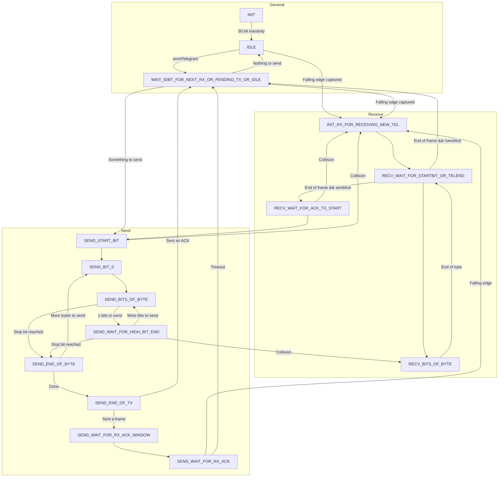

# Functionality supported by the class Bus
- Supported frames:
    - standard data frame 
    - acknowledge frame
- Not supported frames:
    - poll frame 
    - extended frame
- Bus-Busy detection for start of normal frames and ACK-frames
- Collision detection for all send bytes, supports receiving of collided telegram
- Extended collision detection for ACK frame due to possible parallel sending of devices and bus delay
- repetition of telegram after NACK, no ACK or BUSY after idle time (50bit) or busy wait (150bit)
- sending BUSY to remote if rx-buffer is not free (higher layer still processing last telegram)
- support of ETS provided repeat value for normal repeat and busy repeat (loaded from EPROM)
- support of default phy addr (15.15.255) for normal device in case of uninitialized phy. addr. 0.0.0 from EPROM, 0.0.0 is only allowed for a Router device

**The used timer should have the highest priority of the used interrupts in the lib and the app**

As the priority is set at reset to the highest level for all peripheral interrupt sources, any used peripheral interrupt should be set to
a lower level by a call of the CMSIS `void NVIC_SetPriority (IRQn_t IRQn, uint32_t priority)` function with respective IRQn
and a prio >0 (0 is the highest level for periph.).

Support for debugging and dumping of data on the serial line - configuration is in the `libconfig.h` header
and serial support need to be started with a high baud rate (recommended 1.5Mb) in the app module. Debugging usages timer32_0 for time measurement on bit/byte level

Compile time switches: see `libconfig.h` 

## Interface to upper layers
See `bus.h` for details.

For interfacing to higher layers there are data buffer for sending and receiving of telegrams:

| **Tx**                            |                                                                                                                           |
|:----------------------------------|:--------------------------------------------------------------------------------------------------------------------------|
| `bcu->sendTelegram[]`             | send buffer                                                                                                               |
| `sendTelegram(char* telegram,..)` | send a new telegram (pointer to `telegram` to be sent), is blocking if no buffer is available (current transmit ongoing)  |
| `sendTelegramState()`             | state of the last send process                                                                                            |
| `sendingTelegram()`               | test if there is a tel being sent                                                                                         |

| **Rx**                    |                                                                                                                                                                                                                             |
|:--------------------------|:----------------------------------------------------------------------------------------------------------------------------------------------------------------------------------------------------------------------------|
| `bus.telegram[]`          | receive buffer                                                                                                                                                                                                              |
| `telegramLen`             | indicating the number of bytes received in bus.telegram[], telegramLen ==0 indicates an empty buffer, should be set to 0 by the higher layer after telegram was processed, set to the number of rx bytes by the rx process  |
| `receivedTelegramState()` | state of the last rx process                                                                                                                                                                                                |
| `telegramReceived()`      | test if there is a tel waiting in the buffer                                                                                                                                                                                |

### Bus access module initializing:
- Load physical address from eeprom
- If 0.0.0, set to default 15.15.255 if not compiled as router
- initialize the timer
- initialize tx and rx port
- wait for 50 bit times
- enter the IDLE state.

### The `timer16_x` is used as follows:
- Capture register `CR0` is used for receiving
- Match register `MR0` or `MR1` is used as PWM for sending, depending on which output pin is used
- Match register `MR3` is used for timeouts while sending / receiving
- depending on state: cap event and/or timeout event are used to trigger interrupt, match to reset the timer.

**todo** Use of cap event to reset timer in order to have a more precise timing related to the start bit.

### For receiving: 
Timer is restarted with capture event at falling edge of start-bit, loaded with character time (11 bits) for timeout
and reset with timeout after stop-bit.  After send of character, timer is running to measure the next events: eg. next
character (after 208µs), end of telegram ( after 308µs), send of acknowledge  1560µs -pre-send-time(104µs ->1456µs)
next state either tx or wait for timeout at idle time (50bit) - pre-send-time (5096µs) for next action.
No pending action:    continue waiting in idle state for cap event: rx start, or timeout ( set in send telegram): tx start .

### For transmitting:
Sending of char is using the PWM function in a tricky way. As we need a positive pulse for 35µs as first part of the bit
and 69µs low pulse as second part of bit we need to shift the phase by 69µs relative to normal bit timing on the bus:
 -> the  sending is split in the two half bit:  high phase of bit n-1 followed by low phase of bit n. In addition, the falling edge
of the 35µs pulse is triggering the capture event for the start bit or any low bit following a high bit.

Timer is started pre-send (104µs) time before the falling edge of start bit, start-bit is generated by PWM pulse
set for 104µs, end of pulse 104µs+ 35µs pulse time. We are now at the rising edge of the start bit,  following bits by PWM set
for 69µs low phase, 35µs high terminated by pwm period of 104µs till end of byte incl parity and stop. After stop-bit, timer is
running to measure next time out of 2 filling bits (208µs) before next character is send or waiting for ACK to be received or
start of next action in 50 bit times.
For rx of ACK, the ACK-window start is at 15bit times -5µs -margin of 100µs,  waiting for ACK window ends
at 15µs +30µs+margin of 100µs.

### Telegram/byte/bit sending principle:
 The sending is started from higher layers by a call to `sendTelegram` with a pointer to the telegram-buffer and the telegram-length.
 We add our physical address, checksum, set the match interrupt, timeout in 1µs and set `WAIT_50BT_FOR_NEXT_RX_OR_PENDING_TX_OR_IDLE` state,
 initialize some parameters (`sendTries=0`...) for the telegram. In `WAIT_50BT_FOR_NEXT_RX_OR_PENDING_TX_OR_IDLE we check for ACK` to be sent
 or a necessary repetition of the telegram and set the pre-send waiting time accordingly. A cap event is indicating the reception of the
 start bit from us or any other device. We check the receive window (for an ACK this is optional with a longer window) if the trigger is not
 from our startbit falling edge. If not we continue with the rx process in `RECV_WAIT_FOR_STARTBIT_OR_TELEND`, else
 we wait for a timeout at the rising edge of the start bit and continue with bit0 in `SEND_BIT_0` followed by `SEND_BITS_OF_BYTE` for sending
 remaining bits. When we reached the stop bit to send we check for more character to be send -> then we continue after additional
 wait time of 3 high bits (stop + 2 filling bits) and start bit with the sending  in `SEND_BIT_0`. If we reached end of telegram, we send/wait only
 for the stop bit  and align the phase shift (-69µs) to be in sync with normal bus timing in `SEND_END_OF_TX`. Next we wait for the ACK window
 to start in `SEND_WAIT_FOR_RX_ACK_WINDOW`, with the timeout, we enable cap event interrupt again and wait for the ACK to be received till end
 of ACK window in `SEND_WAIT_FOR_RX_ACK`. At timeout we need to repeat the telegram and wait in `WAIT_FOR_IDLE50` or we continue
 receiving the ACK with a cap event in `WAIT_50BT_FOR_NEXT_RX_OR_PENDING_TX_OR_IDLE`. If we receive a positive ACK we prepare for next
 telegram to send and wait 50 bit times in `WAIT_FOR_IDLE50 WAIT`. If we received a BUSY from remote, we wait 150 bit time in
 `WAIT_FOR_IDLE50 WAIT` the before we repeat the telegram in `WAIT _FOR_NEXT_RX_OR_PENDING_TX`.
 The end of transmission is indicated to higher layer by the `bus_tx_state` parameter, which is set after a tx process in send next telegram

### Telegram/byte/bit HIGH level receiving principle:
 A falling edge of a start bit is triggering the capture interrupt. For the first bit of a new telegram, the interrupt is
 received in the `WAIT_50BT_FOR_NEXT_RX_OR_PENDING_TX_OR_IDLE` or `IDLE` state and all parameter for a new telegram are initialized.
 The timer is restarted/re-loaded with the cap and match is to the character length of 11 bits.
 Bits are received and after the stop bit (timeout) the timer is restarted and match set for next start bit in 2 bit times+margin.
 For intermediate bytes, the cap. interrupt for the first bit of a new byte is received in state `RECV_WAIT_FOR_STARTBIT_OR_TELEND`.
 If we receive a timeout instead, we have the end of the telegram reached (>2bit times after last stop bit) and process it.
 If the sending side is waiting for an ACK we process the received data as ACK or as normal telegram at the data layer.
 At the data layer, we check for correct telegram (parity, checksum, length), if it is for us, data is moved to the tx buffer of higher layers and
 possible transmission of an ACK is prepared and waited to send the ACK or waited for next rx or pending tx.

 If it is a cap event for the start bit, we initialize the timer-match interrupt, cap interrupt, restart, preset with time elapsed
 since cap interrupt. to relate all timings to the start bit falling edge on the bus, set match value to byte time (11 bit: start,
 8 data, parity, stop:1144µs). Next state is `RECV_BITS_OF_BYTE` to collect all data bits of the character including parity and stop.
 If we receive a timeout in this state, the character (11 bits) is completely collected, we set the match to wait the 2 bits
 (incl some margin) between two characters and set next state to `RECV_WAIT_FOR_STARTBIT_OR_TELEND`. A cap. event is triggering 
 the reception of a new character and the bits will be collected in `RECV_BITS_OF_BYTE`. A timeout is indicating the end of the
 telegram and we check the received data. After checking of the data, we typically wait for the window to send an ACK back to the remote
 sender in `RECV_WAIT_FOR_TX_ACK_WINDOW`. The window ends `PRE_SEND_TIME` before we possibly need to ACK the telegram in
 `RECV_WAIT_FOR_ACK_TX_START`, cap event is re-enabled and sending prepared, or if no reply needed, we wait 50 bit times in
 `WAIT_FOR_IDLE50`, cap event is re-enabled and enter next state `WAIT_50BT_FOR_NEXT_RX_OR_PENDING_TX_OR_IDLE`.

The cap. interrupt is disabled during the waiting period between the last action of RX/TX
and the start of the `WAIT_FOR_IDLE50` state to improve for bus noise handling.
For the rx process a local rx buffer is used to allow for data processing on higher layer of previous buffer and parallel interrupt driven rx of
a new telegram. If the processing of the rx buffer at higher layer is not completed when a new telegram was received, a BUSY is send
back to the sender as acknowledge and we wait 150 bit times for the repeated telegram.

**todo we could disable any cap event during waiting.**

## State Machine

## Main requirements based on KNX Specification 2.1
### Physical Layer

| Bit decoding timing                                                |      minimum (µs)      |    typical (µs)     |                        maximum (µs)                         |
|:-------------------------------------------------------------------|:----------------------:|:-------------------:|:-----------------------------------------------------------:|
| bit time                                                           |                        |         104         |                                                             |
| bit pulse duration                                                 |           25           |         35          | 70 (due to overlay of same pulse and propagation delay) |
| acceptance window for leading edge relative to start bit   |        n*104-7         |        n*104        |                          n*104+33                           |
| time distance from start bit to start bit of next char     | 13*104-30   (1322) | 13*104   (1352) |                    13*104+30  (1382)                    |

| Bit coding timing                                                 |    minimum (µs)     |   typical (µs)    |    maximum (µs)     |
|:------------------------------------------------------------------|:-------------------:|:-----------------:|:-------------------:|
| bit time                                                          |                     |        104        |                     |
| bit pulse duration                                                |         34          |        35         |         36          |
| time from start bit to following bits within single char  |       n*104-2       |       n*104       |       n*104+2       |
| time distance from start bit to start bit of next char    | 13*104-2 (1350) | 13*104 (1352) | 13*104+5 (1357) |

| Timing                                    |    µs     |   µs     |    µs     |  µs    |
|:------------------------------------------|:---------:|:--------:|:---------:|:------:|
| for bus idle (no traffic on bus)  |  >53*104  |          |           |  5512  |
| between 2 normal frames                   | 53*104-50 | >=53*104 |           | >=5512 |
| between telegram and repeated telegram    | 50*104-50 |  50*104  | 53*104-50 |  5200  |

| time between end of telegram |        µs         |       µs        |        µs          | µs   |
|:-----------------------------|:-----------------:|:---------------:|:------------------:|:----:|
| and start of ACK/NACK/BUSY   |                   |                 |                    |      |
| for bit coding               |     15*104-5      |     15*104      |     15*104+20      | 1560 |
| for bit decoding             | 15*104-5 1555 | 15*104 1560 | 15*104+30 1590 |      | 

| timeout between end of frame |      µs       |   µs    |
|:-----------------------------|:-------------:|:-------:|
| and wait for ACK/NACK/BUSY   | >=30u+15*104  | >=1590  |

| time between end of ACK/NACK/BUSY |    µs     |   µs    |
|:----------------------------------|:---------:|:-------:|
| and begin of next telegram        | >=50*104  | >=5200  |

|                                                |    µs    |     µs     |        µs        |
|:-----------------------------------------------|:--------:|:----------:|:----------------:|
| time between two characters within a telegram  | >=2*104  | <=2.5*104  | 208 <= t <= 260  |

### Line BUSY detection
Immediately before transmission of the start bit of a first character of a frame the bus is checked, if any other device is already transmitting.
This must be done for start of normal and repeated frame (and fill characters in poll situations - not used).
In case the bus is busy no transmission is started and line_busy is indicated to upper layers.
For the transmission of an ACK/NACK/BUSY and inner frame characters line-busy detection is optional
(is implemented  for ACK/NACK/BUSY with extended detection window before the start bit).
In case of line-busy, no transmission should be started. Line busy window ends 7µs before falling edge of start bit of normal frames
and 16µs for ACK frames. Any reception after that window will be detected as possible collision.

### Collision detection
Shall be never disabled during transmission (disable for sent of ACK is an option).
In case of a collision, the transmission should be stop immediately and indicated to the upper layer functions.
A collision is detected if a logical 1 (HIGH level) was sent but at the same time a LOW level pulse was detected.

### Data Link Layer transmit
Typical frames of a device will be acknowledged by the remote receiver with ACK/NACK/BUSY. If the acknowledgment
is positive, the ACK should be indicated to upper layers. In case of BUSY, the frame should be resent after waiting
at least 150 bit times line idle. Resent should be done for maximum `busy_retry` times. If BUSY is received for more than
`busy_retry` times, the upper layer should be informed with transmission status not_ok/error.
In all other cases (NACK, corrupted frame or time out after 30 bit times..) the frame shall be repeated for `nak_retry`
times after 50 bit times waiting. The status should be indicated to the upper layers.

### Data Link Layer receive
A received frame should be processed only if it is addressed:
 - to own physical address
 - a group address found in the address table
 - broadcast address (0.0.0)

- If the received frame is not correct (parity/checksum,length...error) a NACK should be sent
- If frame is correct but the device is busy (e.g. input queue full,...) a BUSY should be sent
- If frame is correct an ACK should be sent

**We send no acknowledge when we did receive an incorrect frame or correct frame which was not for us**

Changes: Oct 2021 by Horst Rauch
- cleanup of some unused states and idle, convey error-result/status of a RX/TX process on the bus to the com-object level
- added some comments
- fixed collision detection issue while sending ACK/NACK/BUSY
- introduction of collision detection window according to spec for pulse duration of 25µs - 70µs due to propagation delay
- added default phy-adr for normal devices and router (compilation with ROUTER defined)
- added some states to SM for better readability of the code, BUSY handling,...
- added error handling, convey info to upper layers
- added local rx buffer for parallel processing of rx telegram and receiving and reply with BUSY to remote sender
- added BUSY acknowledgment handling
- added repeated telegram reception handling
- added some debug macros, use of timer32_0 for debugging of state machine timing
- debugging  with high speed serial terminal interface (1.5Mbaud) at PIO2_7 and PIO2_8

Copyright (c) 2021 Horst Rauch